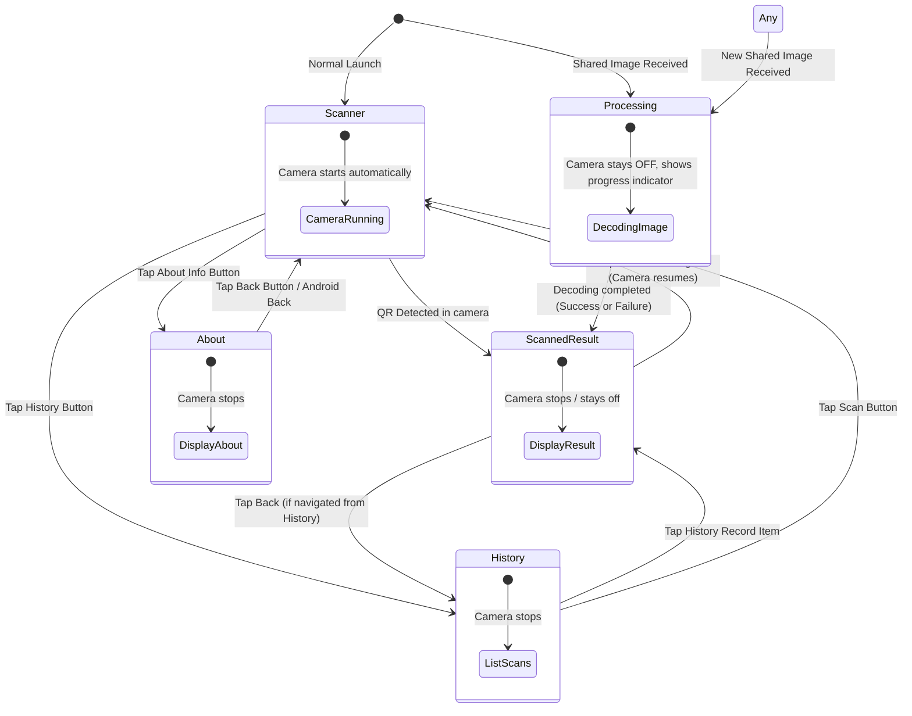

# Architecture & Navigation Specification

## 1. Overview
QR Scanner is a cross-platform Avalonia UI application (.NET 10) targeting Android, iOS, and Desktop (macOS/Windows/Linux).

The UI uses a **single-state navigation model** where `MainViewModel.CurrentPage` directly determines the active screen and camera lifecycle.

---

## 2. Navigation Tree & Views

```
MainView (Root Shell with dynamic ContentControl + modular bottom button bar)
│
├── 📷 1. ScanView (DataContext: ScanViewModel)
│     └── Fullscreen camera viewfinder & continuous frame analyzer
│
├── ⏳ 2. ProcessingView (DataContext: ProcessingViewModel)
│     └── Simple non-camera loading state while a shared image is being decoded
│
├── 📜 3. HistoryView (DataContext: HistoryViewModel)
│     └── Searchable list of past scans with thumbnail previews & delete action
│
├── 📋 4. ScanResultView (DataContext: ScanResultViewModel)
│     ├── State A: Success (from live scan, shared image, or history item click)
│     │     ├── Image preview snapshot
│     │     ├── Content type badge (Website, Wi-Fi Network, Email, Phone, Contact Card, Text)
│     │     ├── Decoded text / structured content
│     │     └── Contextual action buttons (Open Link, Connect to Wi-Fi, Copy, Share, Scan Again)
│     └── State B: Failure (unreadable shared image)
│           ├── Source image preview
│           ├── Error explanation
│           └── "Scan with camera" action button
│
└── ℹ️ 5. AboutView (DataContext: AboutViewModel)
      ├── App version & documentation
      └── Reset all data confirmation modal
```

---

## 3. State Diagram & Segues



---

## 4. Lifecycle & Hardware Rules

- **Camera Rule**: `Scan.StartAsync()` runs **if and only if** `CurrentPage is ScanViewModel`. When switching to `HistoryViewModel`, `ScanResultViewModel`, or `AboutViewModel`, the camera automatically unbinds and native preview surfaces detach.
- **Unified Detail Page**: Live camera scans, shared photos/screenshots, and history item clicks all route to the same `ScanResultView` / `ScanResultViewModel`.
- **Navigation Bar Component**: The bottom button bar is only rendered when `IsNavBarVisible` (`CurrentPage is ScanViewModel or HistoryViewModel`), making it easy to style or replace with any custom button bar component.
