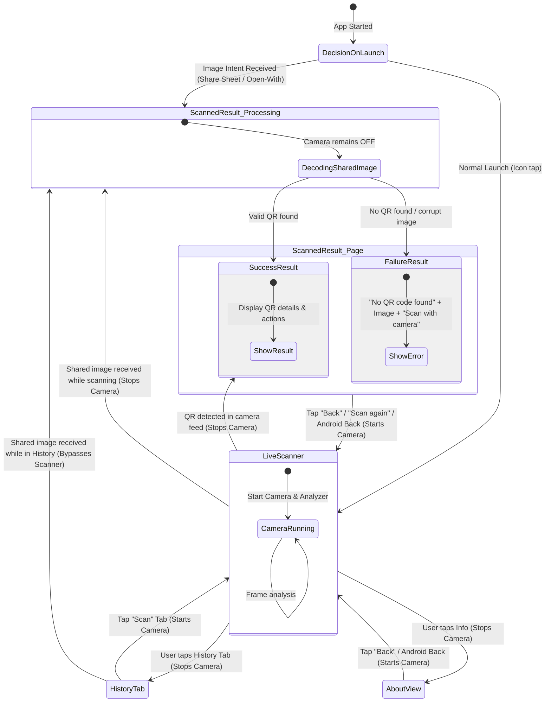

# Architecture & Navigation Specification

## 1. Overview
QR Scanner is a cross-platform Avalonia UI application (.NET 10) targeting Android, iOS, and Desktop (macOS/Windows/Linux). The application features two primary ingest pipelines:
1. **Live Camera Scanner**: Real-time camera viewfinder with continuous frame analysis.
2. **External Image Sharing**: Receiving images from other applications via Android Share Sheet (`ACTION_SEND`, `ACTION_SEND_MULTIPLE`, `ACTION_VIEW`), iOS Open-In / Share extensions, and Desktop Drag & Drop / CLI arguments.

---

## 2. Navigation Tree & Views

```
Root Shell (MainView / MainWindow)
│
├── 📷 1. Live Camera Scanner (`ScanView` & `ScanViewModel`)
│     ├── Active Camera Viewport & Viewfinder overlay
│     └── Status pill & continuous frame analyzer
│
├── 📋 2. Scanned Result Page (`ScanResultView` & `ScanResultViewModel`)
│     ├── State A: Success
│     │     ├── Image preview snapshot
│     │     ├── Content type badge (Website, Wi-Fi Network, Email, Phone, Contact Card, Text)
│     │     ├── Decoded text / structured content
│     │     └── Contextual action buttons (Open Link, Connect to Wi-Fi, Copy, Share, Scan Again)
│     └── State B: Failure (No QR code detected / unreadable image)
│           ├── Source image preview
│           ├── Error explanation
│           └── "Scan with camera" action button
│
├── 📜 3. Scan History (`HistoryView` & `HistoryViewModel`)
│     ├── Searchable list of past scans with thumbnail previews
│     └── Detail sheet with actions (Copy, Open, Connect, Share, Delete)
│
└── ℹ️ 4. About View (`AboutView` & `AboutViewModel`)
      ├── App version & documentation
      └── Reset all data confirmation modal
```

---

## 3. State Diagram & Segues



---

## 4. Segue Rules & Lifecycle Management

| Source State | Trigger Event | Destination State | Hardware & Lifecycle Actions |
|---|---|---|---|
| **App Launch** | Share Sheet (`ACTION_SEND`, `ACTION_VIEW`) | **Scanned Result Page** | **Do NOT start camera.** Parse intent URI with Android `ClipData` / stream, decode in background, navigate directly to Result (Success or Failure). |
| **App Launch** | Icon tap (Normal) | **Live Scanner** | Initialize DB, start camera preview & frame analysis. |
| **Live Scanner** | QR detected in camera frame | **Scanned Result Page (Success)** | **Stop camera preview & unbind CameraX**, save snapshot, show Scanned Page with actions. |
| **Live Scanner** | Tap "History" tab or "About" | **History / About** | **Stop camera preview**. |
| **Scanned Result Page** | Tap "Back", "Scan again", or Android hardware back | **Live Scanner** | Clear active result, return to scan tab, **start camera preview**. |
| **Scanned Result Page** | New image shared from another app | **Scanned Result Page (New Result)** | Camera stays stopped; replace current result with new outcome. |

---

## 5. Shared Ingest Pipeline (`ExternalImageHandler`)

1. **Queueing Before UI**: On mobile platforms, the OS intent or URL open handler may arrive prior to Avalonia UI and ViewModel initialization. `ExternalImageHandler` buffers image byte arrays in an internal thread-safe queue.
2. **Processing & Registration**: When `MainViewModel` initializes, it registers its handler which immediately drains any buffered payloads before starting the camera.
3. **High-Resolution Progressive Decoding**: `QrDecoder.DecodeImageBytes` implements a multi-stage decoding strategy (1280px fast-path downscaling followed by native full-res fallback) on a threadpool worker to guarantee sub-50ms response times for large camera photos and high-DPI screenshots.
